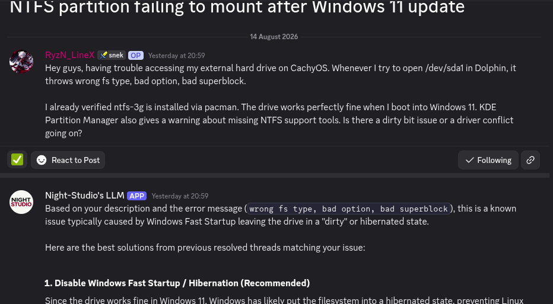
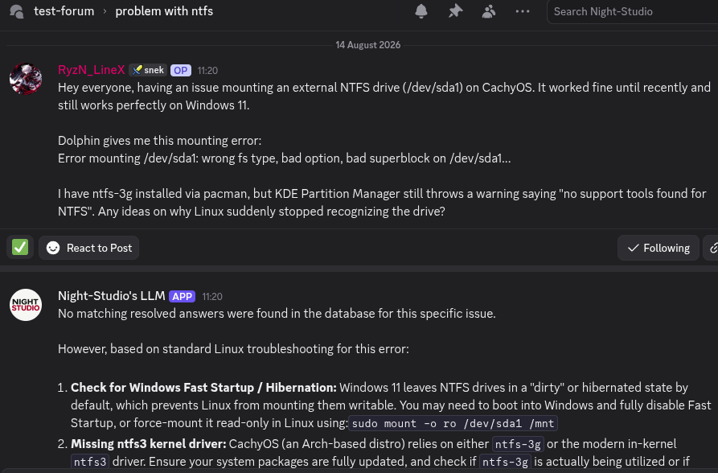

# Night-Studio's LLM

**A discord bot for Night-Studio server**

## What it does?
This bot is specially designed for forum post management. 
The special feature of this bot is **It can scans all the post from the forum and remembers them**. When someone creates a new post in the forum the agent first retrieves relevant memories from the vector db and return that if exists. The bot automatically answers the user questions.

If no relevant memories found the bot still try to give general answers.

**Note: The bot doesn't reply back any messages. It only writes a message on new thread creation.**

## How to use it
Follow these steps to get the bot running and connected to a forum channel.

- **Install dependencies**: create a virtual environment and install requirements:

```bash
python -m venv .venv
source .venv/bin/activate
pip install -r requirements.txt
```

- **Environment variables**: create a `.env` file at the project root with the following keys:

```
BOT_TOKEN=your_discord_bot_token_here
GEMINI_API_KEY=your_google_gemini_api_key_here
GROQ_API_KEY=your_groq_api_key_here
```

- **Run the bot**:

```bash
python bot.py
```

- **Set up a forum channel (one-time, per server)**: In Discord, run the slash command `/set_up_forum` and choose the Forum channel you want the bot to monitor. You must have Administrator permissions to run this command. This stores the chosen forum channel in `database/bot.db`.

- **Scan existing threads**: Run `/scan_forum` (Administrator only). This command will iterate current and archived threads in the configured forum, summarize each thread, and add the summaries to the Chroma vector database (stored under `chroma_db/`).

- **Automatic replies on new threads**: When a new thread is created in a configured forum channel the bot will:
	- fetch the starter message and thread title,
	- generate a search query, retrieve related memories from the vector DB,
	- ask the LLM to compose a response, and
	- post the response in the new thread.

- **Permissions**: Ensure the bot has at minimum: `View Channels`, `Send Messages`, `Read Message History`, and `Use Slash Commands`. Administrator privileges are required for `/set_up_forum` and `/scan_forum`.

- **Data and storage**:
	- Configured forum channels are stored in `database/bot.db`.
	- Vector embeddings and documents are stored in the `chroma_db/` directory (includes `chroma.sqlite3`).

- **Troubleshooting**:
	- If the bot fails to start, confirm `.env` keys are present and valid.
	- If slash commands do not appear, re-invite the bot with `applications.commands` scope or wait a few minutes for registration to sync.
	- Check the bot process logs/console output for detailed error messages.

## Commands
| Command | Description |
|---------|-------------|
| /set_up_forum_channel   | Set up a forum channel where the forum bot will write messages |
| /scan_forum   | Scans every thread in the forum  |

## Reference images
The bot answers if relevant memories found.


The bot answers if no relevant memories found.


## Tool used
- py-cord
- chromadb
- pydantic_ai
- google-genai
- sqlite3


**Made by Renerfia!**
